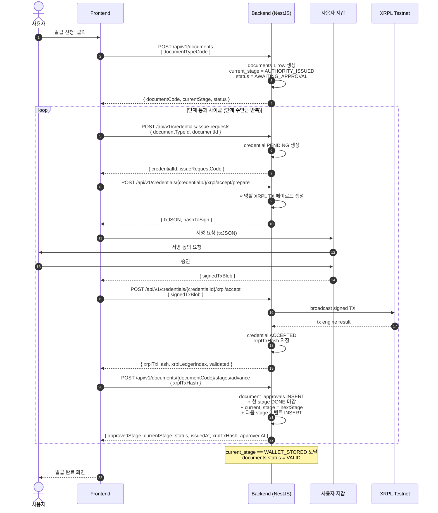
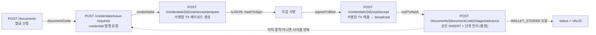

# Document Issue Flow — FE 호출 시퀀스 가이드

문서 발급 ~ XRPL credential 발행 ~ 단계 전이까지, 프론트엔드가 호출해야 하는 API 시퀀스를 정리한 문서.

- 대상 독자: FE 구현자
- 범위: 사용자가 "발급 신청" 버튼을 눌러 `documents.status = VALID` 가 될 때까지의 전체 흐름
- 인증: 모든 엔드포인트는 `Authorization: Bearer <accessToken>` 필수 (JwtAuthGuard)

---

## TL;DR

```
[1] POST /api/v1/documents          ───── 발급 신청 (딱 1회)
                                          │
        ┌─────────────────────────────────┘
        │ 아래 4스텝은 "한 단계 통과" 사이클
        │ 단계 수만큼 반복
        ▼
[2] POST /api/v1/credentials/issue-requests
[3] POST /api/v1/credentials/{credentialId}/xrpl/accept/prepare
[4] POST /api/v1/credentials/{credentialId}/xrpl/accept
[5] POST /api/v1/documents/{documentCode}/stages/advance
        │
        └── current_stage == WALLET_STORED 가 되면 종료 → documents.status = VALID
```

- `[1]` 발급 신청서(=송장) 생성. **1회만 호출**.
- `[2]~[5]` 한 단계(stage) 통과를 위한 묶음. **사용자 승인이 필요한 단계 수만큼 반복**.

> **이전 버전 차이**: 기존엔 단계 통과 사이클이 5스텝(`approvals` + `stages/advance` 분리) 이었지만,
> 두 API 가 항상 짝으로 묶여 갔고 중간 상태 누수 위험이 있어 **단일 `stages/advance` 호출**로 통합했습니다.

---

## 도메인 한 줄 정리

| 도메인 | 책임 | 비유 |
|---|---|---|
| `documents` | 종이 서류의 5단계 발급/이동 파이프라인 추적 | 택배 송장 + 배송 추적 로그 |
| `credentials` | 그 결과물에 대한 XRPL XLS-70 증서 발행 | 졸업장 → 디지털 졸업증 발행 |

- `documents` = 마스터 1건 (`documentCode` 1개). 단계 진행에 따라 `current_stage` 가 갱신.
- `document_stages` = 그 마스터에 매달리는 단계별 이벤트 로그 (단계 진행마다 INSERT).
- `document_approvals` = 사용자가 각 단계 통과를 동의했다는 서명 증거(xrplTxHash) 누적.
- `credentials` / `credential_issue_requests` = XRPL 증서 발행 컨텍스트. 단계 통과의 산출물(xrplTxHash) 을 만드는 역할.

---

## 전체 시퀀스 다이어그램



---

## 한 사이클 안의 데이터 흐름

각 API 가 무엇을 입력받고 무엇을 다음 스텝에 전달하는지.



---

## API 별 상세

### 1. `POST /api/v1/documents` — 발급 신청

| 항목 | 값 |
|---|---|
| 시점 | 사용자가 카탈로그에서 한 종류를 골라 "발급 신청" 클릭 |
| 호출 횟수 | **전체 흐름에서 1회** |
| FE 입력 | `documentTypeCode` (예: `KR-NTS-TAX-PAYMENT`) |
| BE 동작 | `documents` 1 row 생성 + 첫 `document_stages` 이벤트(PENDING) INSERT |
| FE 회수 | `documentCode`, `currentStage` (= `AUTHORITY_ISSUED`), `status` (= `AWAITING_APPROVAL`) |

> `documentCode` 는 이후 모든 사이클에서 그대로 들고 다닐 식별자.

### 2. `POST /api/v1/credentials/issue-requests` — credential 발행 요청

| 항목 | 값 |
|---|---|
| 시점 | 한 단계를 통과시키기 시작 |
| FE 입력 | `documentTypeId`, `documentId` (= `documentCode`) |
| BE 동작 | `credential_issue_requests` + `credentials` (status=PENDING) 1 row 생성 |
| FE 회수 | `credentialId`, `issueRequestCode` |

### 3. `POST /api/v1/credentials/{credentialId}/xrpl/accept/prepare`

| 항목 | 값 |
|---|---|
| 시점 | credential 발행 요청 직후 |
| FE 입력 | (path) `credentialId` |
| BE 동작 | 사용자 지갑이 서명할 XRPL TX 페이로드 생성. **서버는 서명 안 함** |
| FE 회수 | `txJSON`, `hashToSign` 등 서명용 페이로드 |

### 3.5. 지갑 서명 (BE 호출 아님)

- FE 가 지갑 모듈(Web3Auth 등) 에 `txJSON` 전달
- 사용자 동의 → 지갑이 seed 로 서명 → `signedTxBlob` 반환

### 4. `POST /api/v1/credentials/{credentialId}/xrpl/accept`

| 항목 | 값 |
|---|---|
| 시점 | 지갑 서명 후 |
| FE 입력 | (path) `credentialId`, (body) `signedTxBlob` |
| BE 동작 | XRPL 에 broadcast → engine result/ledgerIndex 확인 → credential ACCEPTED 저장 |
| FE 회수 | `xrplTxHash`, `xrplLedgerIndex`, `validated` |

> **이 단계의 산출물 `xrplTxHash` 가 다음 스텝의 핵심 입력**.

### 5. `POST /api/v1/documents/{documentCode}/stages/advance` — 단계 승인 + 전이 (통합)

| 항목 | 값 |
|---|---|
| 시점 | accept 응답 직후 |
| FE 입력 | (path) `documentCode`, (body) `xrplTxHash` |
| BE 동작 | (1) `document_approvals` INSERT (stage = 통과시킬 다음 단계, xrplTxHash 기록) (2) 현 stage PENDING 이벤트 DONE 마감 (3) `documents.current_stage` 를 다음 stage 로 갱신 (4) 다음 stage 의 이벤트 신규 INSERT. WALLET_STORED 도달 시 `status = VALID`, `issuedAt = now` |
| FE 회수 | `approvedStage`, `currentStage`, `status`, `issuedAt`, `xrplTxHash`, `approvedAt` |
| 제약 | 본인 소유 문서만 가능 / 이미 종착(WALLET_STORED) 인 문서 거부 / 같은 단계 중복 호출은 (document_id, stage) UNIQUE 로 차단 (409 `DOCUMENT_STAGE_ALREADY_APPROVED`) |

> 응답의 `currentStage` 가 `WALLET_STORED` 면 사이클 종료. 그 외엔 같은 사이클 반복.

---

## 5단계 파이프라인 reference

```
AUTHORITY_ISSUED        — 기관에서 문서 발급
DOCUMENT_ARRIVED        — 번역공증사무소 도착
TRANSLATED_NOTARIZED    — 번역 / 공증 완료
APOSTILLE_ISSUED        — 아포스티유 발급
WALLET_STORED           — 사용자 지갑 저장 (종착)
```

---

## FE 구현 팁

1. **state 보존**: `documentCode`, `credentialId`, `xrplTxHash` 는 단계 사이에서 들고 다닐 값. 새로고침 대비해 store/localStorage 에 보관.
2. **지갑 모달 위치**: 3 → 4 사이. accept 응답이 와야 5번 호출 가능.
3. **에러 회복**: 어느 스텝에서 끊겼는지 모르면 `GET /api/v1/documents/{documentCode}` 로 현재 `currentStage` / `currentSubstep` 조회해서 사이클 어디부터 다시 탈지 결정.
4. **사이클 종료 판정**: `stages/advance` 응답의 `currentStage == "WALLET_STORED"` && `status == "VALID"` 일 때 발급 완료 처리.
5. **단계별 첨부 파일**: 단계 사이에 파일 업로드가 필요하면 `POST /api/v1/documents/files/upload` 또는 `…/upload-encrypted` 사용 (stage 파라미터 같이 보냄).

---

## 관련 코드 위치

- 컨트롤러: `src/app/interfaces/document/controller/document.controller.ts`, `src/app/interfaces/credential/controller/credential.controller.ts`
- 도메인 서비스: `src/app/domain/document/service/document.service.ts`, `src/app/domain/credential/service/credential.service.ts`
- Swagger 데코레이터: `src/app/interfaces/document/swagger/document.swagger.api.ts`, `src/app/interfaces/credential/swagger/credential.swagger.api.ts`
- 스키마: `prisma/schema.prisma` (Document, DocumentStage, DocumentApproval, CredentialIssueRequest, Credential)
